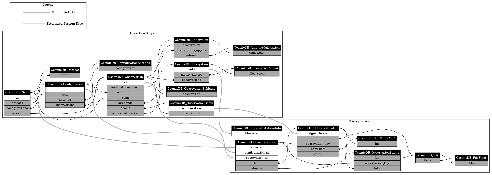

# COSMIC Database

This library explicates the [entities](./docs/tables.md) of the database used to capture observational results from COSMIC.

Class diagrams for showing the fields and relationships are included in the generated [classes documentation](./docs/classes.md).

<details>
<summary>Expand this to see the class diagrams.</summary>


</details>

## Entity Hierarchy

The overarching COSMIC database is scoped into distinct [Operational](#operation-scope) and [Storage](#storage-scope) databases.

There are "dislocated" Foreign Keys that bridge the two scopes which are not implemented as actual constraints within the separate databases but can inform inter-scope queries.



### Operation Scope
This database is hosted on-site at the VLA and serves the following purposes:
- provide all information pertinent to operational queries about COSMIC's observations.
- support high-level scientific queries about which coordinates have been observed and how, with information about which Storage Database to follow through to.

[Full class documentation](./docs/classes.md#operation-database-scope)

The commensal observations made under COSMIC are made within the 'scan's that the VLA sections its time into. Scans are grouped into datasets higher up.

An observation during a scan requires COSMIC to configure its components (FEngines primarily, but also the data-acquisition and post-processing pipeline).
An observation is undertaken with some calibration in place.
An observation is a collection of subbands
An observation can have beams that are produced in the processing of the data.

Calibrations are the result of observations.

Observation outputs are separated into their own database that is local to their storage unit.

### Storage Scope
This database is initially hosted on-site at the VLA when being populated and then is hosted off-site for read-only purposes. It provides meta-data for observational products that are stored on the filesystem alongside the database as well as the related files's paths.

[Full class documentation](./docs/classes.md#storage-database-scope)

## Operation

### CLI

Provided by the package is the `cosmicdb_inspect` executable which allows selection queries to be made with results printed or written to file.

### Programmatic

The programmatic interface is pythonic, using SQLAlchemy (see the page about using select statements, our implementation uses their Object Relational Mapper (ORM) entities (quickstart)).
An exemplary script follows, selecting CosmicDB_Observation entities that have a start field after 04/09, and before 04/10, and printing each result:

```python
from sqlalchemy

from cosmic_database import entities
from cosmic_database.engine import CosmicDB_Engine

engine = CosmicDB_Engine(engine_conf_yaml_filepath="/home/cosmic/conf/cosmicdb_conf.yaml")

with engine.session() as session:
    for result in session.scalars(
        sqlalchemy.select(entities.CosmicDB_Observation)
        .where(
            entities.CosmicDB_Observation.start > datetime.fromisoformat("2023-04-09 00:00:00"),
            entities.CosmicDB_Observation.start < datetime.fromisoformat("2023-04-10 00:00:00"),
        )
    ):
        print(result)
```

Look at the definition for the ORM entities [here](./src/cosmic_database/entities.py) for the definition of nested entities and fields.

I.e. asides from the fields of its cosmic_observation table, it has `CosmicDB_ObservationConfiguration, CosmicDB_Scan, List["CosmicDB_ObservationSubband"], List["CosmicDB_ObservationBeam"]` attributes... these would be accessible in the results of the boilerplate script above (ie result.subbands).

## Database Maintenance

### Setup new server
<details>
<summary> Shouldn't need to do this section </summary>
```bash
# mkdir /var/log/mysql/
# chown mysql:mysql /var/log/mysqld
# mkdir /var/run/mysqld
# chown mysql:mysql /var/run/mysqld
```

```bash
# mkdir ./cosmic_db/mysql_datadir
# chown mysql:mysql ./cosmic_db/mysql_datadir
# cd ./cosmic_db
# mysqld --initialize --user=mysql --datadir=./mysql_datadir
#
# echo [mysqld] >> mysql.cnf
# echo socket = /var/run/mysqld/mysqld.sock
# echo mysqlx_socket = /var/run/mysqld/mysqlx.sock
# echo pid-file = /var/run/mysqld/mysqld.pid
# echo user = mysql >> mysql.cnf
# echo datadir = $(pwd)/mysql_datadir >> mysql.cnf
# echo port = 3307 >> mysql.cnf
# echo mysqlx_port = 33070 >> mysql.cnf
# echo bind-address = 0.0.0.0 >> mysql.cnf
# echo mysqlx-bind-address = 0.0.0.0 >> mysql.cnf
# echo key_buffer_size = 16M >> mysql.cnf
# echo log_error = /var/log/mysql/error.log >> mysql.cnf
```

Then install a systemd service that executes `/usr/sbin/mysqld --defaults-file=/srv/cosmicfs*/cosmic_db/mysql.cnf` and start the service.

For first time startup, the root user will be assigned a random password, printed in `/var/log/mysql/error.log`.
Change this by logging in `mysql --port 3307 --protocol=TCP -u root -p`.
</details>

```
mysql> ALTER USER 'root'@'localhost' IDENTIFIED BY 'MyNewPass';
mysql> CREATE USER 'cosmic'@'%' IDENTIFIED BY 'password';
```

Then see the [next section](#create-a-database).

### Create a database
```
mysql> CREATE DATABASE dbname;
mysql> GRANT ALL PRIVILEGES ON `dbname`.* TO `cosmic`@`%`;
```


### Committing Filesystem and Mount Entities

Gather information about the filesystem to be written to the database, from the host machine:
```bash
$ lsblk -o name,size,mountpoint,label,uuid
```

A provided convenience CLI, `cosmicdb_write_filesystem_mount`, minimises the admin of creating novel Filesystems when necessary and leverages the expected pattern of host-mount and network-mount paths.

A more manual method would be to write the appropriate entities to the database using the provided `cosmicdb_write` CLI.

### Create a table for a new ORM entity

```python
from cosmic_database import entities
from cosmic_database.engine import CosmicDB_Engine

engine = CosmicDB_Engine(engine_conf_yaml_filepath="/home/cosmic/conf/cosmicdb_conf.yaml")
entities.CosmicDB_StampHitRelationship.__table__.create(engine.engine)
```

## Documentation Generation

The documentation is generated by a [script](./docs/run.py), just execute it from within the ['docs' directory](./docs/).