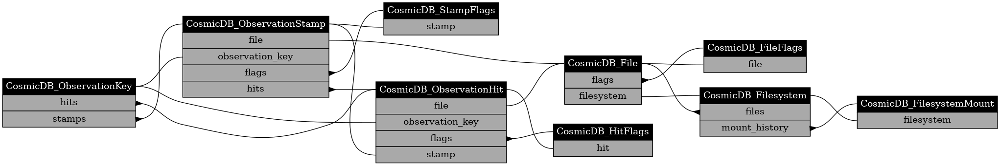

# COSMIC Database

This library explicates the [entities](./docs/tables.md) of the database used to capture observational results from COSMIC.

Class diagrams for showing the fields and relationships are included in the generated [classes documentation](./docs/classes.md).

<details>
<summary>Expand this to see the class diagrams.</summary>


</details>

## Entity Hierarchy

### Operation Scope
[Full class documentation](./docs/classes.md#operation-database-scope)


The commensal observations made under COSMIC are made within the 'scan's that the VLA sections its time into. Scans are grouped into datasets higher up.

An observation during a scan requires COSMIC to configure its components (FEngines primarily, but also the data-acquisition and post-processing pipeline).
An observation is undertaken with some calibration in place.
An observation is a collection of subbands
An observation can have beams that are produced in the processing of the data.

Calibrations are the result of observations.

Observation outputs are separated into their own database that is local to their storage unit.

### Storage Scope
[Full class documentation](./docs/classes.md#storage-database-scope)



## Operation

### CLI

Provided by the package is the `cosmicdb_inspect` executable which allows selection queries to be made with results printed or written to file.

### Programmatic

The programmatic interface is pythonic, using SQLAlchemy (see the page about using select statements, our implementation uses their Object Relational Mapper (ORM) entities (quickstart)).
An exemplary script follows, selecting CosmicDB_Observation entities that have a start field after 04/09, and before 04/10, and printing each result:

```
from sqlalchemy

from cosmic_database import entities
from cosmic_database.engine import CosmicDB_Engine

engine = CosmicDB_Engine(engine_conf_yaml_filepath="/home/cosmic/conf/cosmicdb_conf.yaml")

with engine.session() as session:
    for result in session.scalars(
        sqlalchemy.select(entities.CosmicDB_Observation)
        .where(
            entities.CosmicDB_Observation.start > datetime.fromisoformat("2023-04-09 00:00:00"),
            entities.CosmicDB_Observation.start < datetime.fromisoformat("2023-04-10 00:00:00"),
        )
    ):
        print(result)
```

Look at the definition for the ORM entities [here](./src/cosmic_database/entities.py) for the definition of nested entities and fields... For instance, the selected `CosmicDB_Observation` ORM entity instance is defined as

```
class CosmicDB_Observation(Base):
    __tablename__ = f"cosmic_observation{TABLE_SUFFIX}"

    id: Mapped[int] = mapped_column(primary_key=True)
    scan_id: Mapped[String_ScanID] = mapped_column(ForeignKey(f"cosmic_scan{TABLE_SUFFIX}.id"))
    configuration_id: Mapped[int] = mapped_column(ForeignKey(f"cosmic_observation_configuration{TABLE_SUFFIX}.id"))
    start: Mapped[datetime]
    end: Mapped[datetime]
    criteria_json: Mapped[String_JSON]

    configuration: Mapped["CosmicDB_ObservationConfiguration"] = relationship()

    scan: Mapped["CosmicDB_Scan"] = relationship(
        back_populates="observations"
    )

    subbands: Mapped[List["CosmicDB_ObservationSubband"]] = relationship(
        back_populates="observation", cascade="all, delete-orphan"
    )

    beams: Mapped[List["CosmicDB_ObservationBeam"]] = relationship(
        back_populates="observation", cascade="all, delete-orphan"
    )
```

I.e. asides from the fields of its cosmic_observation table, it has `CosmicDB_ObservationConfiguration, CosmicDB_Scan, List["CosmicDB_ObservationSubband"], List["CosmicDB_ObservationBeam"]` attributes... these would be accessible in the results of the boilerplate script above (ie result.subbands).

## Database Maintenance
### Create a table for a new ORM entity

```
from cosmic_database import entities
from cosmic_database.engine import CosmicDB_Engine

engine = CosmicDB_Engine(engine_conf_yaml_filepath="/home/cosmic/conf/cosmicdb_conf.yaml")
entities.CosmicDB_StampHitRelationship.__table__.create(engine.engine)
```

## Documentation Generation

The documentation is generated by a [script](./docs/run.py), just execute it from within the ['docs' directory](./docs/).