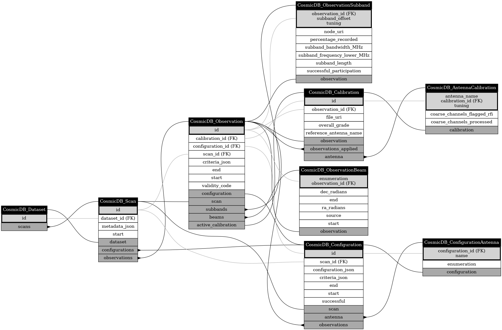
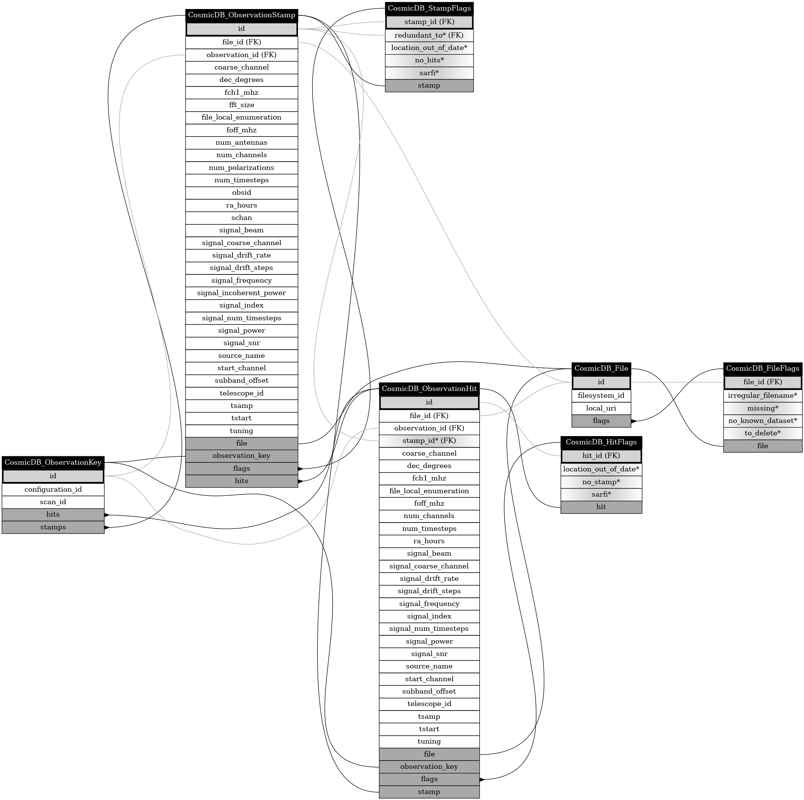

# Operation Database Scope

## Class `CosmicDB_OperationDatabaseInfo`

Table [`cosmic_operation_database_info`](./tables.md#table-cosmic_operation_database_info)

Attribute | Type
-|-
archival_filesystem_mount_id | `str`
end | `int`
id | `datetime`
start | `int`
filesystem_mount | [CosmicDB_FilesystemMount](#class-cosmicdb_filesystemmount)
## Class `CosmicDB_Dataset`

Table [`cosmic_dataset`](./tables.md#table-cosmic_dataset)

Attribute | Type
-|-
id | `datetime`
scans | list([CosmicDB_Scan](#class-cosmicdb_scan))
## Class `CosmicDB_Scan`

Table [`cosmic_scan`](./tables.md#table-cosmic_scan)

Attribute | Type
-|-
dataset_id | `str`
id | `str`
metadata_json | `str`
start | `str`
dataset | [CosmicDB_Dataset](#class-cosmicdb_dataset)
configurations | list([CosmicDB_Configuration](#class-cosmicdb_configuration))
observations | list([CosmicDB_Observation](#class-cosmicdb_observation))
## Class `CosmicDB_Configuration`

Table [`cosmic_configuration`](./tables.md#table-cosmic_configuration)

Attribute | Type
-|-
configuration_json | `datetime`
criteria_json | `str`
end | `str`
id | `datetime`
scan_id | `int`
start | `str`
successful | `datetime`
scan | [CosmicDB_Scan](#class-cosmicdb_scan)
antenna | list([CosmicDB_ConfigurationAntenna](#class-cosmicdb_configurationantenna))
observations | list([CosmicDB_Observation](#class-cosmicdb_observation))
## Class `CosmicDB_ConfigurationAntenna`

Table [`cosmic_configuration_antenna`](./tables.md#table-cosmic_configuration_antenna)

Attribute | Type
-|-
configuration_id | `bool`
enumeration | `int`
name | `int`
configuration | [CosmicDB_Configuration](#class-cosmicdb_configuration)
## Class `CosmicDB_Calibration`

Table [`cosmic_calibration`](./tables.md#table-cosmic_calibration)

Attribute | Type
-|-
file_uri | `str`
id | `str`
observation_id | `int`
overall_grade | `int`
reference_antenna_name | `float`
observation | [CosmicDB_Observation](#class-cosmicdb_observation)
observations_applied | list([CosmicDB_Observation](#class-cosmicdb_observation))
antenna | list([CosmicDB_AntennaCalibration](#class-cosmicdb_antennacalibration))
## Class `CosmicDB_AntennaCalibration`

Table [`cosmic_calibration_antenna_result`](./tables.md#table-cosmic_calibration_antenna_result)

Attribute | Type
-|-
antenna_name | `str`
calibration_id | `str`
coarse_channels_flagged_rfi | `int`
coarse_channels_processed | `int`
tuning | `int`
calibration | [CosmicDB_Calibration](#class-cosmicdb_calibration)
## Class `CosmicDB_Observation`

Table [`cosmic_observation`](./tables.md#table-cosmic_observation)

Attribute | Type
-|-
archival_filesystem_uuid | `str`
calibration_id | `str`
configuration_id | `int`
criteria_json | `int`
end | `str`
id | `datetime`
scan_id | `int`
start | `str`
validity_code | `datetime`
archival_filesystem | [CosmicDB_Filesystem](#class-cosmicdb_filesystem)
configuration | [CosmicDB_Configuration](#class-cosmicdb_configuration)
scan | [CosmicDB_Scan](#class-cosmicdb_scan)
subbands | list([CosmicDB_ObservationSubband](#class-cosmicdb_observationsubband))
beams | list([CosmicDB_ObservationBeam](#class-cosmicdb_observationbeam))
active_calibration | [CosmicDB_Calibration](#class-cosmicdb_calibration)
## Class `CosmicDB_ObservationSubband`

Table [`cosmic_observation_subband`](./tables.md#table-cosmic_observation_subband)

Attribute | Type
-|-
flag | `int`
node_uri | `int`
observation_id | `str`
percentage_recorded | `int`
subband_bandwidth_MHz | `float`
subband_frequency_lower_MHz | `float`
subband_length | `float`
subband_offset | `int`
successful_participation | `int`
tuning | `bool`
observation | [CosmicDB_Observation](#class-cosmicdb_observation)
## Class `CosmicDB_ObservationBeam`

Table [`cosmic_observation_beam`](./tables.md#table-cosmic_observation_beam)

Attribute | Type
-|-
dec_radians | `str`
end | `float`
enumeration | `datetime`
observation_id | `int`
ra_radians | `int`
source | `float`
start | `str`
observation | [CosmicDB_Observation](#class-cosmicdb_observation)
## Class `CosmicDB_Filesystem`

Table [`cosmic_filesystem`](./tables.md#table-cosmic_filesystem)

Attribute | Type
-|-
label | `datetime`
uuid | `str`
mount_history | list([CosmicDB_FilesystemMount](#class-cosmicdb_filesystemmount))
observations | list([CosmicDB_Observation](#class-cosmicdb_observation))
## Class `CosmicDB_FilesystemMount`

Table [`cosmic_filesystem_mount`](./tables.md#table-cosmic_filesystem_mount)

Attribute | Type
-|-
end | `str`
filesystem_uuid | `datetime`
host | `str`
host_mountpoint | `str`
id | `str`
network_uri | `int`
start | `str`
filesystem | [CosmicDB_Filesystem](#class-cosmicdb_filesystem)
## Class `CosmicDB_ChangelogEntry`

Table [`cosmic_changelog_entry`](./tables.md#table-cosmic_changelog_entry)

Attribute | Type
-|-
description | `datetime`
timestamp | `str`
## Class `CosmicDB_OperationFlag`

Table [`cosmic_operation_flag`](./tables.md#table-cosmic_operation_flag)

Attribute | Type
-|-
details | `datetime`
id | `str`
# Storage Database Scope

## Class `CosmicDB_StorageDatabaseInfo`

Table [`cosmic_database_info`](./tables.md#table-cosmic_database_info)

Attribute | Type
-|-
filesystem_uuid | `int`
id | `str`
## Class `CosmicDB_ObservationKey`

Table [`cosmic_observation_key`](./tables.md#table-cosmic_observation_key)

Attribute | Type
-|-
configuration_id | `int`
observation_id | `int`
scan_id | `int`
hits | list([CosmicDB_ObservationHit](#class-cosmicdb_observationhit))
stamps | list([CosmicDB_ObservationStamp](#class-cosmicdb_observationstamp))
postprocess_seti_receipts | list([CosmicDB_PostprocessReceiptSETI](#class-cosmicdb_postprocessreceiptseti))
## Class `CosmicDB_File`

Table [`cosmic_file`](./tables.md#table-cosmic_file)

Attribute | Type
-|-
id | `str`
local_uri | `int`
flags | [CosmicDB_FileFlags](#class-cosmicdb_fileflags)
## Class `CosmicDB_FileFlags`

Table [`cosmic_file_flags`](./tables.md#table-cosmic_file_flags)

Attribute | Type
-|-
file_id | `str`
irregular_filename | `int`
missing | `bool`
no_known_dataset | `bool`
to_delete | `bool`
file | [CosmicDB_File](#class-cosmicdb_file)
## Class `CosmicDB_ObservationStamp`

Table [`cosmic_observation_stamp`](./tables.md#table-cosmic_observation_stamp)

Attribute | Type
-|-
coarse_channel | `bool`
dec_degrees | `int`
fch1_mhz | `float`
fft_size | `float`
file_id | `int`
file_local_enumeration | `int`
flag | `int`
foff_mhz | `int`
id | `float`
num_antennas | `int`
num_channels | `int`
num_polarizations | `int`
num_timesteps | `int`
observation_id | `int`
obsid | `int`
ra_hours | `str`
schan | `float`
signal_beam | `int`
signal_coarse_channel | `int`
signal_drift_rate | `int`
signal_drift_steps | `float`
signal_frequency | `int`
signal_incoherent_power | `float`
signal_index | `float`
signal_num_timesteps | `int`
signal_power | `int`
signal_snr | `float`
source_name | `float`
start_channel | `str`
subband_offset | `int`
telescope_id | `int`
tsamp | `int`
tstart | `float`
tuning | `float`
file | [CosmicDB_File](#class-cosmicdb_file)
observation_key | [CosmicDB_ObservationKey](#class-cosmicdb_observationkey)
hits | [CosmicDB_ObservationHit](#class-cosmicdb_observationhit)
## Class `CosmicDB_ObservationHit`

Table [`cosmic_observation_hit`](./tables.md#table-cosmic_observation_hit)

Attribute | Type
-|-
coarse_channel | `str`
dec_degrees | `int`
fch1_mhz | `float`
file_id | `float`
file_local_enumeration | `int`
flag | `int`
foff_mhz | `int`
id | `float`
num_channels | `int`
num_timesteps | `int`
observation_id | `int`
ra_hours | `int`
signal_beam | `float`
signal_coarse_channel | `int`
signal_drift_rate | `int`
signal_drift_steps | `float`
signal_frequency | `int`
signal_incoherent_power | `float`
signal_index | `float`
signal_num_timesteps | `int`
signal_power | `int`
signal_snr | `float`
source_name | `float`
stamp_id | `str`
start_channel | `int`
subband_offset | `int`
telescope_id | `int`
tsamp | `int`
tstart | `float`
tuning | `float`
file | [CosmicDB_File](#class-cosmicdb_file)
observation_key | [CosmicDB_ObservationKey](#class-cosmicdb_observationkey)
sarfi_flag | [CosmicDB_HitFlagSARFI](#class-cosmicdb_hitflagsarfi)
stamp | [CosmicDB_ObservationStamp](#class-cosmicdb_observationstamp)
## Class `CosmicDB_HitFlagSARFI`

Table [`cosmic_hit_flag_sarfi`](./tables.md#table-cosmic_hit_flag_sarfi)

Attribute | Type
-|-
antenna_index | `str`
hit_id | `int`
hit | [CosmicDB_ObservationHit](#class-cosmicdb_observationhit)
## Class `CosmicDB_PostprocessReceiptSETI`

Table [`cosmic_postproc_receipt_seti`](./tables.md#table-cosmic_postproc_receipt_seti)

Attribute | Type
-|-
beamformsearch_args | `int`
beamformsearch_duration_s | `str`
hit_count | `float`
id | `int`
move_duration_s | `int`
observation_id | `float`
sarfi_seive_duration_s | `int`
stamp_count | `float`
subband_offset | `int`
tuning | `int`
observation_key | [CosmicDB_ObservationKey](#class-cosmicdb_observationkey)
## Class `CosmicDB_StorageFlag`

Table [`cosmic_storage_flag`](./tables.md#table-cosmic_storage_flag)

Attribute | Type
-|-
details | `str`
id | `str`