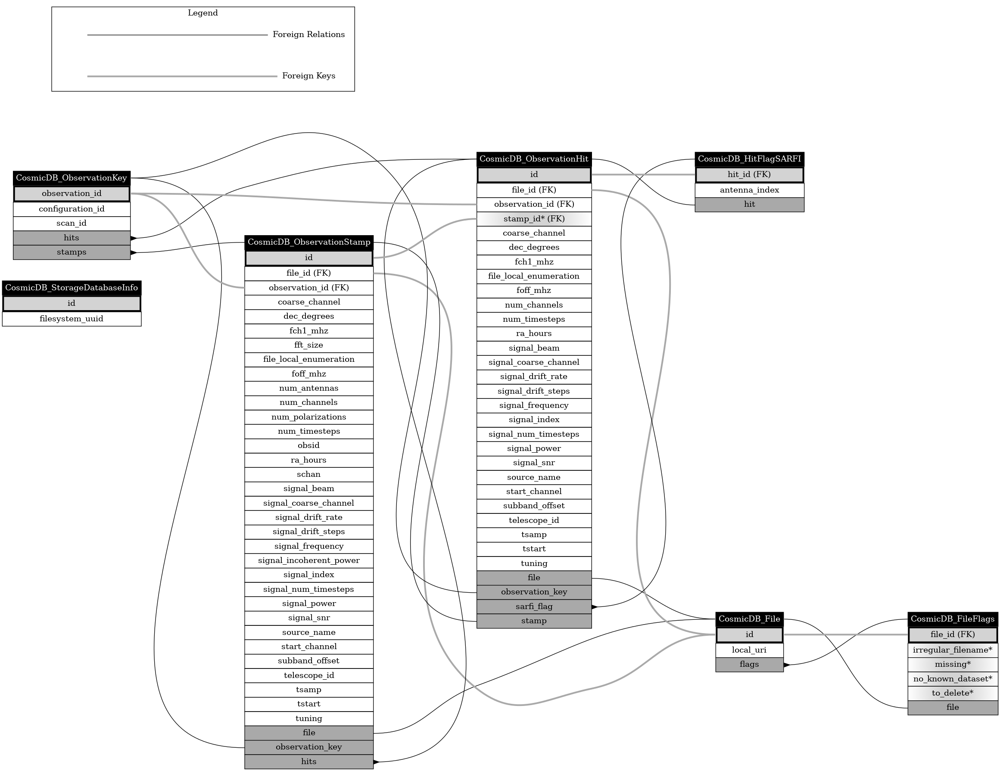

# Operation Database Scope

## Class `CosmicDB_Dataset`

Table [`cosmic_dataset`](./tables.md#table-cosmic_dataset)

Attribute | Type
-|-
id | `str`
scans | list([CosmicDB_Scan](#class-cosmicdb_scan))
## Class `CosmicDB_Scan`

Table [`cosmic_scan`](./tables.md#table-cosmic_scan)

Attribute | Type
-|-
dataset_id | `str`
id | `str`
metadata_json | `str`
start | `datetime`
dataset | [CosmicDB_Dataset](#class-cosmicdb_dataset)
configurations | list([CosmicDB_Configuration](#class-cosmicdb_configuration))
observations | list([CosmicDB_Observation](#class-cosmicdb_observation))
## Class `CosmicDB_Configuration`

Table [`cosmic_configuration`](./tables.md#table-cosmic_configuration)

Attribute | Type
-|-
configuration_json | `str`
criteria_json | `str`
end | `datetime`
id | `int`
scan_id | `str`
start | `datetime`
successful | `bool`
scan | [CosmicDB_Scan](#class-cosmicdb_scan)
antenna | list([CosmicDB_ConfigurationAntenna](#class-cosmicdb_configurationantenna))
observations | list([CosmicDB_Observation](#class-cosmicdb_observation))
## Class `CosmicDB_ConfigurationAntenna`

Table [`cosmic_configuration_antenna`](./tables.md#table-cosmic_configuration_antenna)

Attribute | Type
-|-
configuration_id | `int`
enumeration | `int`
name | `str`
configuration | [CosmicDB_Configuration](#class-cosmicdb_configuration)
## Class `CosmicDB_Calibration`

Table [`cosmic_calibration`](./tables.md#table-cosmic_calibration)

Attribute | Type
-|-
file_uri | `str`
id | `int`
observation_id | `int`
overall_grade | `float`
reference_antenna_name | `str`
observation | [CosmicDB_Observation](#class-cosmicdb_observation)
observations_applied | list([CosmicDB_Observation](#class-cosmicdb_observation))
antenna | list([CosmicDB_AntennaCalibration](#class-cosmicdb_antennacalibration))
## Class `CosmicDB_AntennaCalibration`

Table [`cosmic_calibration_antenna_result`](./tables.md#table-cosmic_calibration_antenna_result)

Attribute | Type
-|-
antenna_name | `str`
calibration_id | `int`
coarse_channels_flagged_rfi | `int`
coarse_channels_processed | `int`
tuning | `str`
calibration | [CosmicDB_Calibration](#class-cosmicdb_calibration)
## Class `CosmicDB_Observation`

Table [`cosmic_observation`](./tables.md#table-cosmic_observation)

Attribute | Type
-|-
calibration_id | `int`
configuration_id | `int`
criteria_json | `str`
end | `datetime`
id | `int`
scan_id | `str`
start | `datetime`
validity_code | `int`
configuration | [CosmicDB_Configuration](#class-cosmicdb_configuration)
scan | [CosmicDB_Scan](#class-cosmicdb_scan)
subbands | list([CosmicDB_ObservationSubband](#class-cosmicdb_observationsubband))
beams | list([CosmicDB_ObservationBeam](#class-cosmicdb_observationbeam))
active_calibration | [CosmicDB_Calibration](#class-cosmicdb_calibration)
## Class `CosmicDB_ObservationSubband`

Table [`cosmic_observation_subband`](./tables.md#table-cosmic_observation_subband)

Attribute | Type
-|-
node_uri | `str`
observation_id | `int`
percentage_recorded | `float`
subband_bandwidth_MHz | `float`
subband_frequency_lower_MHz | `float`
subband_length | `int`
subband_offset | `int`
successful_participation | `bool`
tuning | `str`
observation | [CosmicDB_Observation](#class-cosmicdb_observation)
## Class `CosmicDB_ObservationBeam`

Table [`cosmic_observation_beam`](./tables.md#table-cosmic_observation_beam)

Attribute | Type
-|-
dec_radians | `float`
end | `datetime`
enumeration | `int`
observation_id | `int`
ra_radians | `float`
source | `str`
start | `datetime`
observation | [CosmicDB_Observation](#class-cosmicdb_observation)
# Storage Database Scope

## Class `CosmicDB_ObservationKey`

Table [`cosmic_observation_key`](./tables.md#table-cosmic_observation_key)

Attribute | Type
-|-
configuration_id | `int`
id | `int`
scan_id | `str`
hits | list([CosmicDB_ObservationHit](#class-cosmicdb_observationhit))
stamps | list([CosmicDB_ObservationStamp](#class-cosmicdb_observationstamp))
## Class `CosmicDB_ObservationStamp`

Table [`cosmic_observation_stamp`](./tables.md#table-cosmic_observation_stamp)

Attribute | Type
-|-
coarse_channel | `int`
dec_degrees | `float`
fch1_mhz | `float`
fft_size | `int`
file_id | `int`
file_local_enumeration | `int`
foff_mhz | `float`
id | `int`
num_antennas | `int`
num_channels | `int`
num_polarizations | `int`
num_timesteps | `int`
observation_id | `int`
obsid | `str`
ra_hours | `float`
schan | `int`
signal_beam | `int`
signal_coarse_channel | `int`
signal_drift_rate | `float`
signal_drift_steps | `int`
signal_frequency | `float`
signal_incoherent_power | `float`
signal_index | `int`
signal_num_timesteps | `int`
signal_power | `float`
signal_snr | `float`
source_name | `str`
start_channel | `int`
subband_offset | `int`
telescope_id | `int`
tsamp | `float`
tstart | `float`
tuning | `str`
file | [CosmicDB_File](#class-cosmicdb_file)
observation_key | [CosmicDB_ObservationKey](#class-cosmicdb_observationkey)
flags | [CosmicDB_StampFlags](#class-cosmicdb_stampflags)
hits | [CosmicDB_ObservationHit](#class-cosmicdb_observationhit)
## Class `CosmicDB_ObservationHit`

Table [`cosmic_observation_hit`](./tables.md#table-cosmic_observation_hit)

Attribute | Type
-|-
coarse_channel | `int`
dec_degrees | `float`
fch1_mhz | `float`
file_id | `int`
file_local_enumeration | `int`
foff_mhz | `float`
id | `int`
num_channels | `int`
num_timesteps | `int`
observation_id | `int`
ra_hours | `float`
signal_beam | `int`
signal_coarse_channel | `int`
signal_drift_rate | `float`
signal_drift_steps | `int`
signal_frequency | `float`
signal_index | `int`
signal_num_timesteps | `int`
signal_power | `float`
signal_snr | `float`
source_name | `str`
stamp_id | `int`
start_channel | `int`
subband_offset | `int`
telescope_id | `int`
tsamp | `float`
tstart | `float`
tuning | `str`
file | [CosmicDB_File](#class-cosmicdb_file)
observation_key | [CosmicDB_ObservationKey](#class-cosmicdb_observationkey)
flags | [CosmicDB_HitFlags](#class-cosmicdb_hitflags)
stamp | [CosmicDB_ObservationStamp](#class-cosmicdb_observationstamp)
## Class `CosmicDB_HitFlags`

Table [`cosmic_hit_flags`](./tables.md#table-cosmic_hit_flags)

Attribute | Type
-|-
hit_id | `int`
location_out_of_date | `bool`
no_stamp | `bool`
sarfi | `bool`
hit | [CosmicDB_ObservationHit](#class-cosmicdb_observationhit)
## Class `CosmicDB_StampFlags`

Table [`cosmic_stamp_flags`](./tables.md#table-cosmic_stamp_flags)

Attribute | Type
-|-
location_out_of_date | `bool`
no_hits | `bool`
redundant_to | `int`
sarfi | `bool`
stamp_id | `int`
stamp | [CosmicDB_ObservationStamp](#class-cosmicdb_observationstamp)
## Class `CosmicDB_File`

Table [`cosmic_file`](./tables.md#table-cosmic_file)

Attribute | Type
-|-
id | `int`
uri | `str`
flags | [CosmicDB_FileFlags](#class-cosmicdb_fileflags)
## Class `CosmicDB_FileFlags`

Table [`cosmic_file_flags`](./tables.md#table-cosmic_file_flags)

Attribute | Type
-|-
file_id | `int`
irregular_filename | `bool`
missing | `bool`
no_known_dataset | `bool`
to_delete | `bool`
file | [CosmicDB_File](#class-cosmicdb_file)